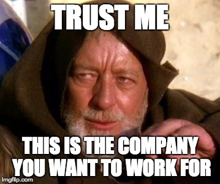
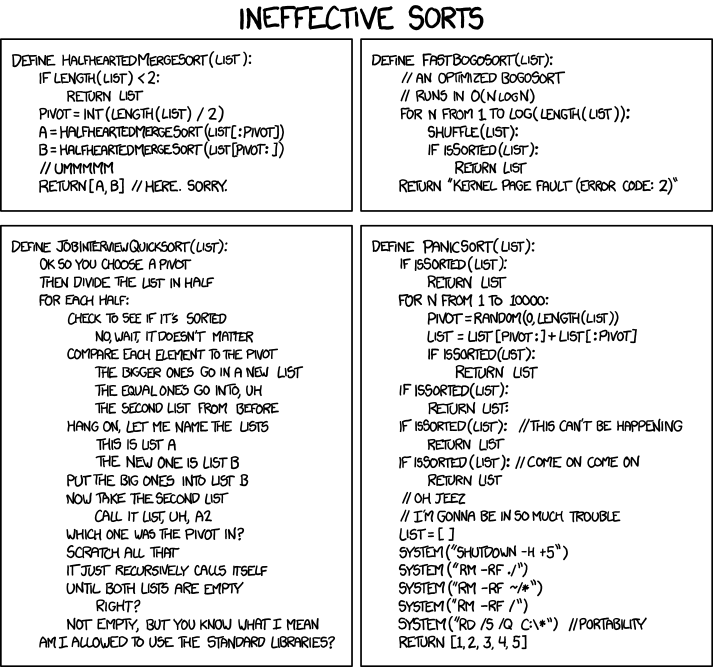

## Who am I?

* Data Incubator Alum, Winter 2015
* PhD, Materials Science, Stanford (Next-Generation Solar Cells)
* 1.5 Years at Alta Devices, solar cell startup
    * 50-100 people, series C startup
    * Both hands-on bench work and simulations
* 2 years at Philips Lumileds, established LED company
    * 5,000 employees, ~ US $1B annual revenue
    * Work on data analytics and device characterization for R&D and production scales
* Data Scientist at Capital One Labs (DC)
    * 40,000 employees, top 10 retail bank in US
    * Work in the data labs division. Identify high-value opportunities and co-develop data science solutions with core business teams.
* Dad of two (overly) energetic boys

---

## Outline

* Choosing a Company
* Importance of Networking
* Social Media in Job Search
* Skill Sets
* Types of Interviews
* Salary Negotiation

---

## Choosing a company

Now is a good time to be a data scientist! 

* Many company want to expand their data science teams. (But not all of them know why.)
* The profession as a whole is receiving a lot of attention (some may say hype.)
* Wide array of open-source tools to choose from. 

The choices of job opportunities can be overwhemling for candidates.

* Scale of the company: startup (early vs. late-stage), established company
* Industry: tech, social network, retail, e-commerce, financial/banking, healthcare, biomedicine, insurance, manufacturing, consulting... etc

---

## Choosing a company as a data scientist

    

---

## Criteria on choosing a company #1

Advices from [Stitch Fix Blog](http://multithreaded.stitchfix.com/blog/2015/03/31/advice-for-data-scientists/):

1. Work for a company that leverages data science for its strategic differentiation:

    Company's core competency depends on its data and analytic capabilities; data science is more than a "supporting role".
    
2. Work for a company with great data:

    There is a difference between "data" and "aspirations of data". Ideally you'll find a company that already has enough data to do interesting things.
    
3. Work for a company with green field opportunities: 

    Look for those companies that have a strong direction and strongly established data science teams, but have an array of problems they are solving for the first time.

---

## Criteria on choosing a company #2

On a more personal level, my criteria is fairly simple:

1. I want to care about what the company is doing.

2. I want to optimize for my own learning opportunities in hands-on data science.

Caveat: "Don't judge a book by its cover".

Be open-minded and throw away preconceived-notion about what you think a company does, or does not, do. (I never thought I'd work for a bank)

---

## But how do you find out?

Good recruiters and hiring managers have vested interest in presenting their best foot forward.

    

---

## But how do you find out?

Ask people who may have more information.

Trust, but verify.

    

---

## Importance of Network and Connections

Connections in your professional network can help you by:

* Give you a heads-up on hiring situations (current or future). - "Our executive team is actively raising money now and had good progress; we will get more headcounts next quarter"

* Give you, within reason, an insider-view on a company that you can't discover on the internet. 
    * Good: "Yeah, we are in consulting, but most of our clients are in the same city, so the travel is not that bad."
    
    * Bad: "Yeah, I heard Evil Corp's data engineer recently left, so their data scientist proably have to do both DS and DE's job."
    
    * Worse: "Yeah, the company's engineering staff is undergoing exodus. All the job postings on website are from 6 months ago."
    
* Give you, within reason, suggestions on interview prep.

* Help you evaluate job opportunities and offers

---

## Where to find connections? LinkedIn!

Immediate connections:

* Your current and former colleagues
* Cohorts of data incubator

Extended connections:

* 2nd degree connections on LinkedIn (I found two of my industry jobs this way!)
* It is highly recommended to establish your presence on LinkedIn
* Asking mutual connection for an introduction, then go for informational interviews

---

## Useful websites - Indeed

* A very good job aggregator. 
* You can set up the job alerts so that it will be delivered daily to your email. I set up alerts for "Data Scientist" jobs in San Francisco bay area, that would be a preTy wide net in itself. 
* You can also set up company specific alerts such as: “Company:(Capital One) (Data Scientist OR Data Engineer) jobs”

---

## Useful websites - Glassdoor

* Glassdoor let employees publish anonymous reviews of the employers. 
* I use this website when I am doing research on the company that I am interested in, often before the information and on-site interviews.

---

## Useful websites - Crunchbase

* Crunchbase has a fairly comprehensive list of startups fund-raising.
* Judging from last funding and employee size, you can gauge the length of the runway.
* Useful for startups; not useful for public companies

---

## Interviews

https://xkcd.com/1185/

    

---

## A Data Scientist's Interview

"Data science interviews are the worst because data science is interdisciplinary: code for "you have to know everything about all the disciplines."  Depending on the company and the team, your interview might look like a software developer’s interview, or it might look a like a statistician's interview, and the bad news is that virtually none of the material overlaps."

-- http://www.erinshellman.com/crushed-it-landing-a-data-science-job/

---

## Skills Required

* Stats / Probability
* Coding / Algorithms
* Modeling and Machine Learning
* Domain Knowledge